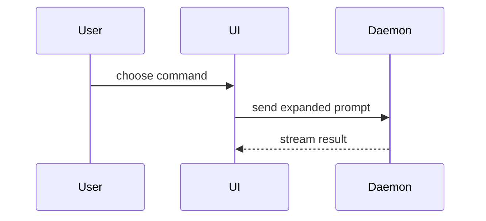

Help the user understand the current topic of conversation visually. This skill is self-contained; do not invoke another skill from within its workflow. Skip the preamble and keep prose brief. Pick the smallest view that makes the key point clear.

- Show logic or an algorithm as pseudocode:

```text
on(save)
  if content is unchanged
    return cached result
  write new content
  return fresh result
```

- Show runtime control flow as a call tree:

```text
submitForm
  createSession
    persistPrompt
    launchAgent
  navigateToSession
```

- Show UI structure as a component tree, including state and module boundaries that matter:

```tsx
<SessionPage> (apps/example/src/routes/session.tsx)
  useSessionEvents()
  <SessionToolbar>
    <RunSkillButton> (packages/ui)
```

- Show file responsibility or a broad refactor as a shallow file tree:

```text
src/
├── commands/       # parses user actions
├── sessions/       # owns session state
└── transport/      # sends API requests
```

- Show component interaction, control flow, or data flow with Mermaid. In Pi, Mermaid renders as fixed-width Unicode and falls back to the fenced source when a diagram exceeds the available terminal width. In Codex clients, rendering varies; do not assume T3 or another frontend renders Mermaid. Use a text view when rendered diagrams are unavailable. Default flowcharts to `TD`; use `LR` only for at most three short nodes. Keep labels brief and move supporting detail into nearby prose. If a diagram is still too large, split it or use a text view instead of escalating to HTML.



- Use `diff` when the point is what changes and the surrounding shape already exists. Match the diff shape to the topic.

For a component change:

```diff
 <SessionPage>
   useSessionEvents()
   <SessionToolbar>
+    <RunSkillButton />
   <SessionTimeline>
+    <SkillResultCard />
```

For a file-layout change:

```diff
 src/
 ├── commands/
+│   └── show-me.ts       # expands the slash command
 ├── sessions/
-└── transport.ts
+└── transport/
+    ├── client.ts
+    └── stream.ts
```

For a call-tree or call-stack change:

```diff
 submitForm
   createSession
     persistPrompt
+    expandSkillMention
     launchAgent
-  navigateToSession
+  navigateToSession
+    subscribeToEvents
```

For a state or control-flow change:

```diff
 on(save)
-  write content
+  if content is unchanged
+    return cached result
+  write new content
+  invalidate cache
```

- Show the whole block when most of it is new, when omitted context would hide ownership or order, or when the user needs a copyable target shape:

```ts
function normalizeCommand(command: string): string {
  return command.trim().toLowerCase()
}
```

- Write HTML only when the user explicitly asks for HTML, a browser artifact, an infographic, a slide deck, or a high-fidelity visual UI or layout. Do not use HTML as a fallback for a dense Mermaid diagram. Match the product's colors, type, spacing, and components; use real labels and data; support desktop and mobile. When a graphical session is available on the user's viewing machine, open it with `open` on macOS or `xdg-open` on Linux. In a headless or remote-host session, return the artifact path or a client-supported artifact link instead; opening a host browser does not open the remote client's browser.

### guidance

Place each visual next to the short text it supports. Keep only the calls, files, props, states, and boundaries needed to answer the user's current question or the options to resolve the current discussion point.

You may use one of these, you may use several, it is unlikely you will use all of them. Use your judgement and don't overwhelm the user.
